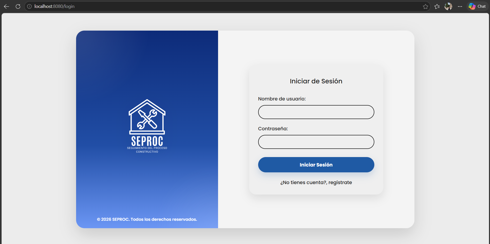
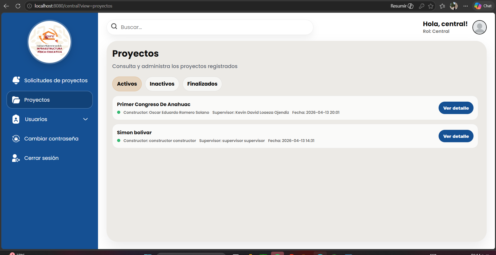
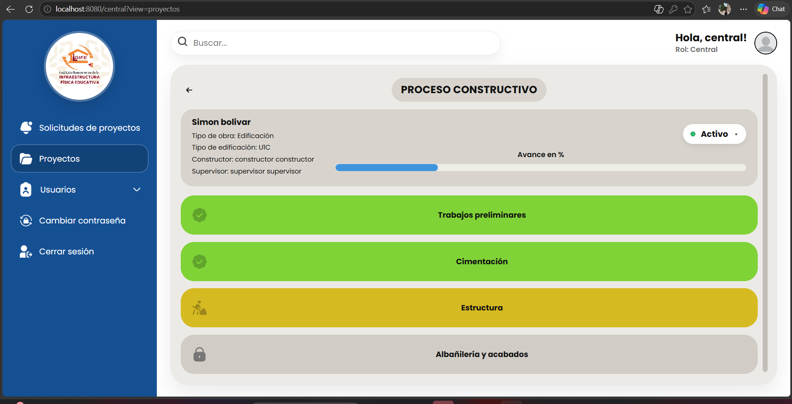
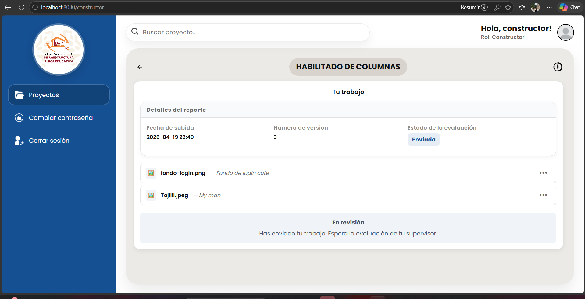
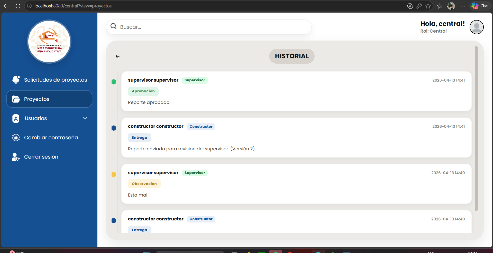

# SeProc

Sistema web para la gestión y seguimiento del proceso constructivo de aulas tipo para **IGIFE**.

## Descripción

SeProc es un sistema web desarrollado para apoyar el seguimiento del proceso constructivo de aulas tipo, permitiendo visualizar el avance de proyectos por etapas, controlar el flujo de trabajo según el rol del usuario y dar seguimiento al historial de entregas, observaciones y revisiones.

El sistema está orientado a una dependencia encargada de la construcción y supervisión de infraestructura educativa.

## Objetivo

Facilitar el control y seguimiento de proyectos de construcción mediante una plataforma web que permita:

- visualizar el avance por etapas del proceso constructivo
- gestionar vistas y permisos por rol
- consultar historial de avances y observaciones
- mejorar el seguimiento de proyectos en ejecución

## Roles del sistema

El sistema contempla distintos tipos de usuario:

- **Constructor**
- **Supervisor**
- **Central**
- **Administración**
- **Dirección**

Cada rol cuenta con vistas y acciones específicas según el flujo del proceso constructivo.

## Funcionalidades principales

- Seguimiento del avance por etapas
- Desbloqueo de procesos conforme al flujo del proyecto
- Visualización de historial de entregas y observaciones
- Vistas diferenciadas por rol
- Interfaz web responsiva
- Consulta de proyectos y detalle de avance

## Tecnologías utilizadas

- **Backend:** Java, Spring Boot
- **Frontend:** Thymeleaf, JavaScript, HTML, CSS
- **Base de datos:** MySQL
- **Control de versiones:** Git y GitHub

## Capturas del sistema

### Inicio de sesión

### Vista de proyectos

### Seguimiento del proceso constructivo

### Subida de evidencias

### Historial

## Mi participación

Participé en el desarrollo del sistema web, colaborando en:

- implementación y ajuste de interfaces web
- lógica funcional para avance por etapas
- desbloqueo de procesos constructivos
- vistas por rol
- integración de backend y base de datos
- mejoras visuales y funcionales del sistema

## Estado del proyecto

Proyecto en desarrollo como parte de residencia profesional.

## Repositorio

Este repositorio contiene el código fuente del sistema SeProc.

## Autores

Desarrollado por el equipo del proyecto SeProc.
